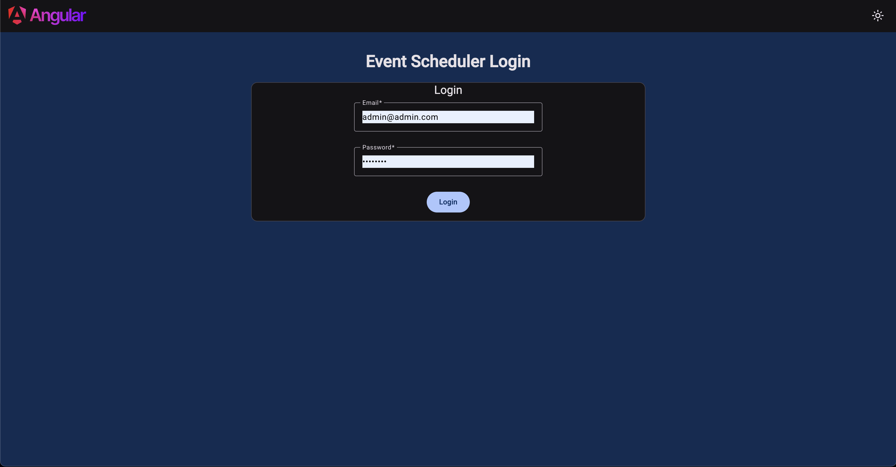

# Event Scheduler .NET & Angular

This is a monorepo project for Event Scheduler .NET & Angular

# .NET Features

- .NET 9
- Entity Framework
- MediatR
- CQRS
- Generic Repository & Unit Of Work pattern
- Union architecture
- Fluent validations
- JWT Authentication
- Real-Time Notifications with SignalR
- Centralized exception handling
- Logging
- Unit tests
- Docker

# .Angular Features

- Angular v19
- Material Design
- Login & Auth mechanism
- Guards
- Routing
- Notifications
- Dark Theme
- Unit tests
- Docker

# Step 1: Building and Running The Projects

You can build and start the applications with Docker or manual setup.

1. Using Docker (Easy way)
   Requirements: Docker
   In the root directory of the repository. run

   > docker-compose up

   This command will run backend at port 8080 and frontend at port 4200. Visit http://localhost:4200 to see the application.
   You can use default users to login

2. Manual setup
   Requirements: .NET 9 SDK, Node.js
   In the root directory of the repository. run

   Run .NET

   > dotnet run --project backend/EventScheduler/src/EventScheduler.Api/EventScheduler.Api.csproj

   Run Angular

   > cd frontend/event-scheduler-angular/
   > npm install
   > npm start

   These commands will run the backend at port 8080 and frontend at port 4200. Visit http://localhost:4200 to see the application.

# Step 2: Logging In

You can use default users to login.

- Username: admin@admin.com Password: admin123
- Username: john@example.com Password: john123

# Step 3: Enjoy
Create your first calendar event after, each user will have their own calendar events and will get notifications for them.

